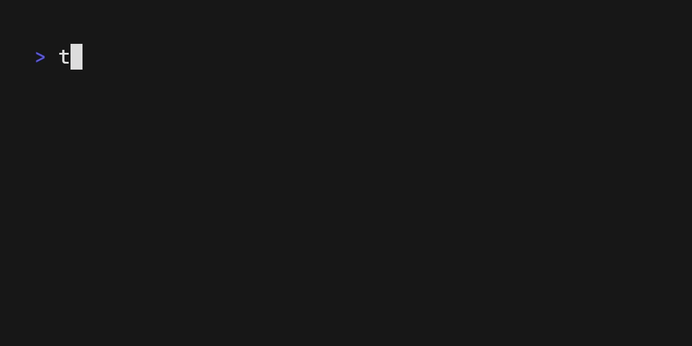

+++ 
draft = false
date = 2025-06-10T15:07:16+02:00
title = "Bootstrapping an AWS Account to Manage Terraform Remote State"
description = ""
slug = ""
authors = []
tags = ["terraform", "aws"]
categories = []
externalLink = ""
series = []
+++

# Bootstrapping an AWS account to manage Terraform remote state

I have been using Terraform to manage AWS infrastructure for many years. Still, nearly all of my experience is within the context of large organizations where a team owns the AWS accounts and has already done some initial setup, often including setting up an S3 bucket and DynamoDB table for managing remote state. Thinking about how to set up a new AWS account for managing Terraform's remote state, I realized that there is a chicken and egg-problem: I need to create an S3 bucket and DynamoDB table to manage the remote state, but I need to have Terraform set up to do that. The solution I came up with is to use Terraform with the local backend to create the S3 bucket and DynamoDB table, then migrate the state to the remote backend afterward. This works well for cases where you run your own account and want all the infrastructure managed by a single tool.

# Steps to bootstrap an AWS account for Terraform remote state management

## Pre-requisites

- An AWS account with the necessary permissions to create S3 buckets and DynamoDB tables.
- The AWS CLI installed and configured with the necessary credentials.
- Terraform installed on your local machine.

## Step 1: Create a Terraform configuration file
Create a new directory for your Terraform configuration and create a file named `main.tf` with the following content:

```hcl
provider "aws" {
  region = "eu-west-1"
}

resource "random_id" "suffix" {
  byte_length = 4
}

# This resource creates an S3 bucket for storing Terraform state files.
# The bucket name is generated using a random suffix to ensure uniqueness.
resource "aws_s3_bucket" "terraform_state" {
  bucket = "terraform-state-${random_id.suffix.hex}"

  tags = {
    Project = "Bootstrap"
    Env     = "admin"
  }
}

# This resource configures the S3 bucket to enable versioning, which is important for maintaining a history of changes to the Terraform state files.
resource "aws_s3_bucket_versioning" "secure_bucket_versioning" {
  bucket = aws_s3_bucket.terraform_state.id
  versioning_configuration {
    status = "Enabled"
  }
}

# This resource sets up server-side encryption for the S3 bucket using AES256 encryption.
resource "aws_s3_bucket_server_side_encryption_configuration" "secure_bucket_encryption" {
  bucket = aws_s3_bucket.terraform_state.id

  rule {
    apply_server_side_encryption_by_default {
      sse_algorithm = "AES256"
    }
  }
}

# This resource configures the S3 bucket to block public access, enhancing security by preventing public access to the bucket and its contents.
resource "aws_s3_bucket_public_access_block" "secure_bucket_block" {
  bucket                  = aws_s3_bucket.terraform_state.id
  block_public_acls       = true
  block_public_policy     = true
  ignore_public_acls      = true
  restrict_public_buckets = true
}

# This resource creates a DynamoDB table to be used for Terraform state locking, which prevents concurrent modifications to the state file.
resource "aws_dynamodb_table" "terraform_locks" {
  name         = "terraform-locks"
  billing_mode = "PAY_PER_REQUEST"
  hash_key     = "LockID"
  attribute {
    name = "LockID"
    type = "S"
  }

  tags = {
    Project = "Bootstrap"
    Env     = "admin"
  }

}
```

## Step 2: Run Initial Terraform Apply with Local State

In the terminal, navigate to the directory where you created the `main.tf` file and run the following command to initialize Terraform:

```bash
terraform init
```
This command will download the necessary provider plugins and set up the backend for your Terraform configuration.



Next, run the following command to create the S3 bucket and DynamoDB table using the local backend:

```bash
terraform plan -out plan.out
```
This command will generate an execution plan and save it to a file named `plan.out`. Review the plan to ensure that it matches your expectations.


Now, apply the plan to create the resources:

```bash
terraform apply "plan.out"
```
This command will execute the plan and create the S3 bucket and DynamoDB table in your AWS account.

## Step 3: Update Terraform Configuration for Remote State

After the resources are created, you need to update your Terraform configuration to use the remote backend for state management. Modify your `main.tf` file to include the following backend configuration:

```hcl
terraform {
  backend "s3" {
    bucket         = "terraform-state-535e23c7" # Replace with your actual bucket name
    key            = "bootstrap/terraform.tfstate"
    region         = "eu-west-1"
    dynamodb_table = "terraform-locks"
    encrypt        = true
  }
}
```

Note that you can't refer to the S3 bucket and DynamoDB table resources you just created in the same configuration file, as Terraform does [not support referenced values in the backend block configuration](https://developer.hashicorp.com/terraform/language/backend#define-a-backend-block). Instead, you will need to manually replace the `bucket` and `dynamodb_table` values with the actual names of the resources you created.

Now you can migrate your local state to the remote backend. Run the following command:

```bash
terraform init -migrate-state
```
This command will initialize the remote backend and migrate your local state to the S3 bucket you created.

# Conclusion

At this point you have bootstrapped your AWS account to manage Terraform remote state using an S3 bucket and DynamoDB table. I normally like to keep my Terraform configurations structure similar to [these recommendations](https://github.com/antonbabenko/terraform-best-practices/tree/master/examples/medium-terraform). I would keep the bootstrap configuration in its own directory, since you will not want to run `terraform destroy` on it. You will want to create a directory for each project you are managing and use the modules to factor out common components that can be reused across projects. This setup allows you to manage your Terraform state effectively and securely in AWS.

Note that you will not be able to destroy this bootstrap infrastructure using Terraform, the purpose of doing things this way is mostly to be able to manage tagging and other configuration changes over time. If you want to be able to destroy these resources it is better to define it with CloudFormation or CDK, but then you will be mixing tools to a limited extent.

# Additional Resources

 * [Terraform best practices](https://www.terraform-best-practices.com/)
 * [Terraform AWS provider documentation](https://registry.terraform.io/providers/hashicorp/aws/latest/docs)
