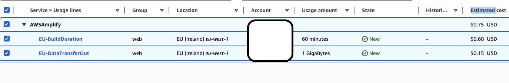
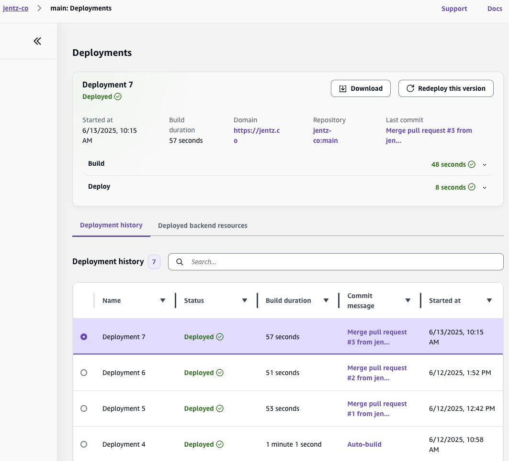

+++ 
draft = false
date = 2025-06-13T15:07:16+02:00
title = "Deploying a Static Website with AWS Amplify"
description = "A practical guide to deploying a static website using AWS Amplify, Hugo, and Terraform. Learn how to leverage Amplify's managed CI/CD, global CDN, and custom domain support for fast, secure, and automated site deployments. Includes code samples and cost estimates."
slug = ""
authors = []
tags = ["terraform", "aws", "hugo"]
categories = ["devops"]
externalLink = ""
images = ["cover.png", "amplify-end.png", "amplify-estimate.png", "amplify-deploy.png"]
series = []
+++


# Deploying a Static Website with AWS Amplify

I wanted to find a nice way to deploy a static website, preferably using AWS, since I am already a happy customer of theirs. Back in 2018, I remember having to set up an S3 bucket, associate it with CloudFront, and issue a TLS cert with ACM. It was a fairly involved process with many moving pieces, but the result was awesome and affordable considering what you got.

It's 2025, so I had a heart-to-heart with Claude and ChatGPT, and they assured me that the good old S3 bucket with CloudFront was still a great option. However, I was just at the AWS Summit in Stockholm and talked to Rickard Löfström about using Amplify for this type of thing, so I wanted to give it a shot.

I am an IaC type of guy with plenty of Terraform experience. Normally, when I start using a new service, I just click-ops my way through it in the console and work with the AWS CLI and Terraform imports to figure out the basic Terraform resource primitives. Once that is done, I extract the results into a module using a combination of hard-won wisdom and common sense to create something I can hopefully use in other situations (rarely do I get the abstraction correct on the first try, but it does tend to be a decent starting point).

## Amplify Features


For a static site, Amplify is essentially __“S3 + CloudFront + ACM + Git + CI/CD”__ in a single, managed service. After connecting Amplify to your GitHub repo, it will build and deploy on every commit. There is support for separating the main production branch from dev branches and even pull-request deployments. 

  * ***Automatic CI/CD:*** Amplify automatically builds and deploys your site on every commit to the connected GitHub repository.
  * ***Global CDN:*** Amazon CloudFront has 400+ Points of Presence (PoPs)
  * ***Custom Domain and TLS cert:*** Amplify manages the ACM cert, no need to fiddle with renewals or validation
  * ***Fully Managed:*** completely managed by AWS, always patched and secure. You only pay for egress and build minutes.

Speaking of price, with 60 build minutes of build time and 1 GB of egress, the estimated cost is 0.75 USD per month. It doesn’t matter how many people are in my team or any weird things like Netlify has.



## Choosing a Static Site Generator

I know my way around Ruby and Node.js, which have famous tools like Jekyll and Eleventy, but I love Go's simplicity with its statically linked binaries. It makes dealing with CI/CD pipelines and local dev environments easy as pie. Hugo fit the bill nicely, so I ran with it. Wait until you see how tiny the build steps are and how quickly they execute.

Here is the GitHub repository for my website: https://github.com/jentz/jentz.co

## Show Me the Code Already

This little Terraform module takes care of the whole shebang.

```hcl
resource "aws_amplify_app" "this" {
  name       = var.app_name
  repository = var.repository_url

  # Only include access_token when github_access_token is set
  # Work around for a bug in the AWS provider that doesn't allow empty/null values for access_token
  access_token = try(length(var.github_access_token) > 0 ? var.github_access_token : tostring({}), null)

  # Hugo build settings
  build_spec = <<-EOT
    version: 1
    frontend:
      phases:
        preBuild:
          commands:
            - curl -L -o hugo.tar.gz https://github.com/gohugoio/hugo/releases/download/v${var.hugo_version}/hugo_extended_${var.hugo_version}_Linux-64bit.tar.gz
            - tar -xzf hugo.tar.gz
            - chmod +x hugo
        build:
          commands:
            - ./hugo --minify
      artifacts:
        baseDirectory: public
      cache:
        paths:
          - ./hugo
  EOT

  # Auto build code when new commits are pushed
  enable_auto_branch_creation = true
  enable_branch_auto_build    = true

  auto_branch_creation_patterns = var.auto_branch_creation_patterns

  # Environment variables
  environment_variables = var.environment_variables

  tags = var.tags
}

# Set up the main branch
resource "aws_amplify_branch" "main" {
  app_id      = aws_amplify_app.this.id
  branch_name = var.main_branch_name

  framework = "Hugo"
  stage     = "PRODUCTION"

  tags = var.tags
}

# Domain association
resource "aws_amplify_domain_association" "this" {
  app_id      = aws_amplify_app.this.id
  domain_name = var.domain_name

  # Set up the main domain
  sub_domain {
    branch_name = aws_amplify_branch.main.branch_name
    prefix      = ""
  }

  # Set up www subdomain if needed
  dynamic "sub_domain" {
    for_each = var.enable_www_subdomain ? [1] : []
    content {
      branch_name = aws_amplify_branch.main.branch_name
      prefix      = "www"
    }
  }

}
```

https://github.com/jentz/aws-infrastructure/blob/1898613a3cc7947ade4a0b9385cea7e7d340c790/terraform/modules/amplify/main.tf

# Conclusion

Amplify is a fantastic service for deploying static websites, especially if you are already using AWS. It simplifies the process significantly, allowing you to focus on your content rather than the infrastructure. The integration with GitHub and the automatic CI/CD pipeline make it a breeze to manage updates and deployments.

Build and deploy times are incredibly fast, hovering at about 1 minute for my little website. We'll see how this holds up over time.



