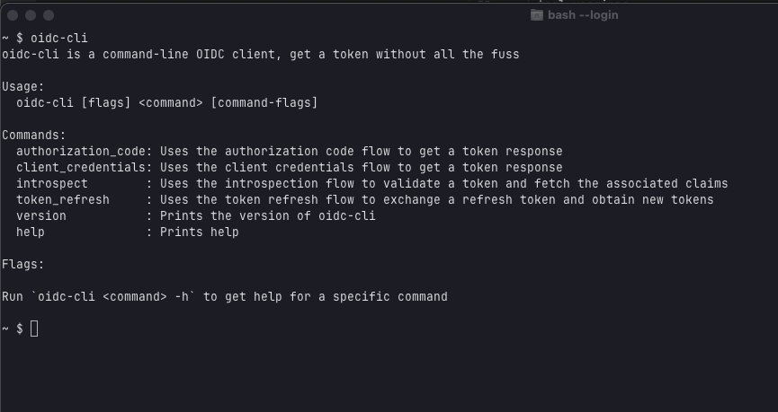

+++ 
draft = false
date = 2025-06-23T15:08:11+02:00
title = "Introduction to oidc-cli"
description = "An introduction to oidc-cli, a tool for managing OIDC tokens and authentication workflows. Learn how to simplify your OIDC interactions with this CLI tool."
slug = ""
authors = []
tags = ["go", "oidc", "oauth2", "cli", "authentication"]
categories = ["devops"]
externalLink = ""
images = ["cover.png"]
series = []
+++



# Introduction to oidc-cli

This post will look at [oidc-cli](https://github.com/jentz/oidc-cli), a command-line tool that simplifies working with OIDC and OAuth2 flows.



The screencast above shows `oidc-cli` running the authorization_code flow, which authenticates a user and returns ID, access, and optionally refresh tokens. I set up an authorization server using AWS Cognito with a public client with client ID `2uc1bc2vfstfp198uvq8shsepa`. A public client is typically used in mobile apps or single-page web applications that cannot keep a secret. The request also uses proof-key for code exchange (PKCE), which is usually required for public clients to prevent the authorization code from being intercepted. You can see the `terraform` [definition](https://github.com/jentz/aws-infrastructure/blob/7f583bc1925e0742b3e5b74f0fc00a22b50ffa88/terraform/cognito-sandbox/main.tf#L88) of this public client in my [aws-infrastructure repository](https://github.com/jentz/aws-infrastructure). 

```sh
oidc-cli -verbose authorization_code \
  -issuer https://cognito-idp.eu-west-1.amazonaws.com/eu-west-1_R7Zfnvwv0 \
  -client-id 2uc1bc2vfstfp198uvq8shsepa \
  -pkce
authorization request: https://eu-west-1r7zfnvwv0.auth.eu-west-1.amazoncognito.com/oauth2/authorize?client_id=2uc1bc2vfstfp198uvq8shsepa&code_challenge=hL-F4FY4et9NJu7qHnnXyVJS6JdVF05pjosBL6IwKmA&code_challenge_method=S256&redirect_uri=http%3A%2F%2Flocalhost%3A9555%2Fcallback&response_type=code&scope=openid
{
  "access_token": "eyJraWQiOiJSNFBodGVnd0tYcWJxVFBNRWxYXC8zREhMZVZnK09kWWFtV2swNzhiN1hBMD0iLCJhbGciOiJSUzI1NiJ9.eyJzdWIiOiIyMjY1ODQyNC1iMDgxLTcwNmUtN2I1Zi05ZGQ2NDAwYWEwNzgiLCJpc3MiOiJodHRwczpcL1wvY29nbml0by1pZHAuZXUtd2VzdC0xLmFtYXpvbmF3cy5jb21cL2V1LXdlc3QtMV9SN1pmbnZ3djAiLCJ2ZXJzaW9uIjoyLCJjbGllbnRfaWQiOiIydWMxYmMydmZzdGZwMTk4dXZxOHNoc2VwYSIsIm9yaWdpbl9qdGkiOiJlMGQyNzUxOS1jN2MwLTRlYjktYWI3Yi03ZGYzOTI1ZWZlZWMiLCJldmVudF9pZCI6IjlhM2Q2NjMwLTc3YTMtNDMwNy05ZTc4LTllZDE2MGZkOWM2OCIsInRva2VuX3VzZSI6ImFjY2VzcyIsInNjb3BlIjoib3BlbmlkIiwiYXV0aF90aW1lIjoxNzUwNjgxNDk4LCJleHAiOjE3NTA2ODUwOTgsImlhdCI6MTc1MDY4MTQ5OCwianRpIjoiYzg4YzRhYWQtNjdmMi00NTIxLTlhODktYzMwZjY5OWQ0ZDBjIiwidXNlcm5hbWUiOiJqZW50eiJ9.Z5fB6Gume_i6DJiwsrzs_Ne5YH1BdAtTnBUDbAnH9WpK0xWduR7WSQlyT4lOS_WGghMLsozfZ9jE59_HgBdtu1ULA5g0_sUKG_M2M6T5ZyV_BmEb4y-RbtuVxu95G71QwtSU3R6VRwB7Lrbnmaq2PbipCDEF0oGaM46_e0O-OUopVraHIfKLSPWW4Yybx1IYOOobkepOFUCa5DDsdLBcXLdTQ-AmJEuyDmOB0kYajxbVbmVB307VHK0_IYlx0Ed89LuBR8OXtBgiw9GIZU4-BH9gBUXuBLUMGz9v0UBC6QBwkInm0veLRiX5Ozj6aDbcFu1L1XQ_6dcb9KZTq3fPWA",
  "expires_in": 3600,
  "id_token": "eyJraWQiOiI4eUEremo2R2ZWQjhuMmd5K29cL29Hdmd4bnliSXUzRVhFNXV4MWlrbGlZOD0iLCJhbGciOiJSUzI1NiJ9.eyJhdF9oYXNoIjoiODhXdTJzQWgxbzlCT25vbUY2MS0wUSIsInN1YiI6IjIyNjU4NDI0LWIwODEtNzA2ZS03YjVmLTlkZDY0MDBhYTA3OCIsImVtYWlsX3ZlcmlmaWVkIjp0cnVlLCJpc3MiOiJodHRwczpcL1wvY29nbml0by1pZHAuZXUtd2VzdC0xLmFtYXpvbmF3cy5jb21cL2V1LXdlc3QtMV9SN1pmbnZ3djAiLCJjb2duaXRvOnVzZXJuYW1lIjoiamVudHoiLCJnaXZlbl9uYW1lIjoiTWFyayIsIm9yaWdpbl9qdGkiOiJlMGQyNzUxOS1jN2MwLTRlYjktYWI3Yi03ZGYzOTI1ZWZlZWMiLCJhdWQiOiIydWMxYmMydmZzdGZwMTk4dXZxOHNoc2VwYSIsImV2ZW50X2lkIjoiOWEzZDY2MzAtNzdhMy00MzA3LTllNzgtOWVkMTYwZmQ5YzY4IiwidG9rZW5fdXNlIjoiaWQiLCJhdXRoX3RpbWUiOjE3NTA2ODE0OTgsImV4cCI6MTc1MDY4NTA5OCwiaWF0IjoxNzUwNjgxNDk4LCJmYW1pbHlfbmFtZSI6IkplbnR6IiwianRpIjoiZjk4NzE5N2ItNDFkMy00YzZmLThjNjItYWE5NGEwNmZlYTQyIiwiZW1haWwiOiJtYXJrLmplbnR6QGdtYWlsLmNvbSJ9.MUQ--C5MeBLBTwBD1azIZlmpPSaboOflPmEuisEk2Czh0JTGg7kpcdPoITV6I9rmlnAMub-22bzBeaJGyAvvtJ-ain2KwK4u099b2PwlBZN7FmC_0K8zcwDuOeLh3HYyNYrlugkHiUSlWob34OFSANV4TrzNlW4Fhz88c1GBLkxFHpOVdblMBubDFHmn3gzOrvuFXnVFXu7NssQXjQnwuEpKX8EH5DDMlD7ubHejyCE8CvrB3eIMcMNtqy5w2E3Wg390OP-_rO7LhmQteXkmxgCpeIghFYVFohhLZcNWlK4rryCU_BnZ7QSs0nbE3JICV1Aq_wCQPVSAN__VBxxuow",
  "refresh_token": "eyJjdHkiOiJKV1QiLCJlbmMiOiJBMjU2R0NNIiwiYWxnIjoiUlNBLU9BRVAifQ.E5yG3Z0s-RLwGbDtIgr7zBC3mGdeoj2CxLaPUlU3leqGA-ZhISd0EFd4decxdztfO9GsHwHFo6WeLS5KQBzJr47QeLBfJQ6vPK0Y9hQWapVy0LinlBzN9KSiQSB22YqhN1ZAj4f14gi_PRwMGTpgYWoE7AonqgGMUek7NsOncK84tiuV783lbUSTQwI_LN76yji7Kf9IvRf3-bvhSrXk2_XEgsdbNKQI0Sl-nXKvx0-KI0Q54237cMZfcsmbgnh0AF1oQ4mlWu1SPpowNpl9UQwjIDryxLIA4njY1UeLtPAev99T7Urls1SZZER-Yu7RQt6qk4Ut8qJmFIGZwdaJVA.d52sOIjqg5RVMs7F.DBZflrTJIIfSIJ3v7xqvxim8zfEkvUWhU1E8kYgqlgkMGCNc_73u7bQObM9PPpavrVKB8onqn3NvvKAG5tRpoVNWsCHJu57kmkv8sVyfF7Obz9RmKVlRroVD0QKqZjn1ie405dAhYTmDao3rB8ltS2FU-8p_qC17w5W3mpKEuGaSRAJOUX_fP6Ny5zq7s4bVT1YMDQR3Ubthb_8XiHWbk5df4L7rdQRhaeAByIwFiCTGYeWMLzKW-XDxcvRHrBRyTpFR4SC5P4uMZXT8wsc96xrGxXNIWlYS8UYd9YQuWVWw-TXlnLWJ9My6fBvPzPpDYT7r89Ucr1yrr2IRK6QG3AS25xgZ61G-0OQpUq_HN-FFTVnwhb26F4Qne4t-1AV9K_D_faGFY53hgt8FGg7VF36NTTZ6foz2Ccg4H_NI5DIc4qzvOyXYxIefbDyC1E7Wxn5wS9UOpj9nPKJmvjUCCPpGV-PAtrngNLTXmoH2yL_rP9Bx6avujDUR5dHhQatQw9b7tJgWmtWGNihdUC-5xH43GGvTaI2qb-WMG5-pGLSkOJT72ZWjsrQGwCtTnyMObp5YtcuUck40JqWCWCo6JAW_bAabz3NDfPZbygwIb3UnqvGFcQrYphlyqwqVkGxuDwAV6U7FLZ4n2D5p6JxSMU8udFO-jY8P1WCkjANilTl32KOe2lJz8I7Yh3T9thzXgHgCqKE5QcwVHjxnz0jR4uFLozgQnw2urXxMueSqVrR_SkGbolP9-Ky6LhNZgmCnjiOq_oo14hdlF8fXHdN_eEq-Qe0-EAxHdlnuMse5WkdDmqjh3GYxxt-NoneRI9lBXUReyJDBycrSgS1TjmyhFRKxG9drLOHx0YYoDjLU6OMeUseok8oZQ5Pj8I8EkSwXDB4JnfT9YQ4guEjW0e1Hc6v5qfsmFCjC3RGHzj447q3FNkaHowIsy2vKdIDaoIrawI5yGRjIx9R7sY1IImDb6qviUAFzcAyivp4AfGRljMK7A9o0a4np2wcTSCY_PSGAvQC1HVAN-r3_OVfO_lMjefJ0dhRiElONzu_ev49d7CM7uQ8MppKWacjB_ahxfomNjxyiqf6ACgKJAoqG9Kcy_Iz_ZGqZTrQg1BIFW8teJ_KR56OJegXNX8_K18LFRUwPbSIPI0DQpOAN1W6zzKageTtYXfcsgi8hXJ4V129T13iKrVYidhu-XgntYLsJN73p59X6lMkN7cwz188_SQmc2uX1HQeeGPnhM3yuLFrhEhQYdwo.EAx2lfAw347UPlYBXiqzxg",
  "token_type": "Bearer"
}
```

  * The end-user runs `oidc-cli authorization_code`.
  * `oidc-cli` parses the options and creates an authorization_code request.
  * `oidc-cli` starts a listener on the redirect URI to receive the auth code.
  * `oidc-cli` tries to open the default browser for the platform to start the flow.
    * If the browser does not open, the end user will see the correct request in the terminal and can manually continue.
  * The authorization server authenticates the user.
  * The authentication redirects the browser to the redirect URI.
  * `oidc-cli` receives the auth code and exchanges it for tokens at the token endpoint.
  * `oidc-cli` prints the token endpoint response body.


sequenceDiagram
    participant U as User
    participant B as Browser
    participant RP as oidc-cli
    participant AS as Authorization Server

    U->>RP: start authorization_code flow
    RP->>B: Open system browser and redirect to AS login page<br>(with client_id, redirect_uri, scope)
    B->>AS: GET /authorize
    AS->>B: present login flow
    B->>U: Prompt for credentials
    U->>AS: Enter credentials
    AS->>B: Redirect to redirect_uri<br>(with authorization code, state)
    B->>RP: GET redirect_uri?code=auth_code&state
    RP->>AS: POST /token<br>(code, client_id, client_secret, redirect_uri)
    AS->>RP: Return access_token, id_token, refresh_token
    RP->>U: Print token response


The token response is output to stdout, while other information is printed on stderr. This allows `oidc-cli` invocations to be chained with commands like [jq](https://jqlang.org/), [jwt-cli](https://github.com/mike-engel/jwt-cli), and `pbcopy`.

The basic form of the command is:

```sh
oidc-cli <global-flags> command <command-specific-flags>
```

Lets break down the example command from above:

```sh
oidc-cli -verbose authorization_code \
  -issuer https://cognito-idp.eu-west-1.amazonaws.com/eu-west-1_R7Zfnvwv0 \
  -client-id 2uc1bc2vfstfp198uvq8shsepa \
  -pkce
```

  * **-verbose** is a global flag that requests verbose output during execution.
  * **-issuer** is the token issuer, this value is used to get OpenID provider metadata. By default, the issuer should provide metadata on the issuer + `/.well-known/openid-configuration`. In the example, this would be https://cognito-idp.eu-west-1.amazonaws.com/eu-west-1_R7Zfnvwv0/.well-known/openid-configuration
  * **authorization_code** is the command we want to run. The authorization_code command allows running the authorization_code flow in various ways.
  * **-client-id** is the client ID for the request
  * **-pkce** will cause the request to be protected by proof-key for code exchange (PKCE)

We will look at the authorization request more closely and break it down.

```
https://eu-west-1r7zfnvwv0.auth.eu-west-1.amazoncognito.com/oauth2/authorize?
```

This is discovered in the metadata, `authorization_endpoint`, which is where the issuer accepts authorization requests.

```
client_id=2uc1bc2vfstfp198uvq8shsepa
```

The client ID comes from the command, we always need a client ID for authorization requests.

```
code_challenge=hL-F4FY4et9NJu7qHnnXyVJS6JdVF05pjosBL6IwKmA
code_challenge_method=S256
```

These parameters are part of the PKCE challenge, they are part of protecting the interaction.

```
redirect_uri=http%3A%2F%2Flocalhost%3A9555%2Fcallback
```

If we URL decode the redirect_uri we see it is http://localhost:9555/callback, which is the default for `oidc-cli`. This can be changed to some other value, but it is recommended that you add this to the client configuration in your authorization server.

```
response_type=code
```

The response type `code` is simply part of the authorization_code flow.

```
scope=openid
```

The scope is `oidc`, which is the default for `oidc-cli`. You can add more scopes with the **-scopes** options, for example, `-scopes "oidc profile email"`.

# Conclusion

`oidc-cli` is a powerful and intuitive tool for streamlining OIDC and OAuth2 authentication workflows directly from the command line. Simplifying complex authorization processes, like the authorization code flow with PKCE, empowers developers, DevOps, and IAM professionals to manage tokens and integrate authentication into their workflows efficiently. Its adherence to the UNIX philosophy of small modular commands with clear input and output streams makes it play nicely with tools like `jq`, `jwt-cli`, and `pbcopy`. Explore the GitHub repository to get started and enhance your OIDC interactions with ease.

# References

  * The OAuth 2.0 Authorization Framework RFC 6749 https://datatracker.ietf.org/doc/html/rfc6749
  * OpenID Connect Core 1.0 https://openid.net/specs/openid-connect-core-1_0.html
  * oidc-cli on GitHub: https://github.com/jentz/oidc-cli
  * aws-infrastructure on GitHub: https://github.com/jentz/aws-infrastructure
